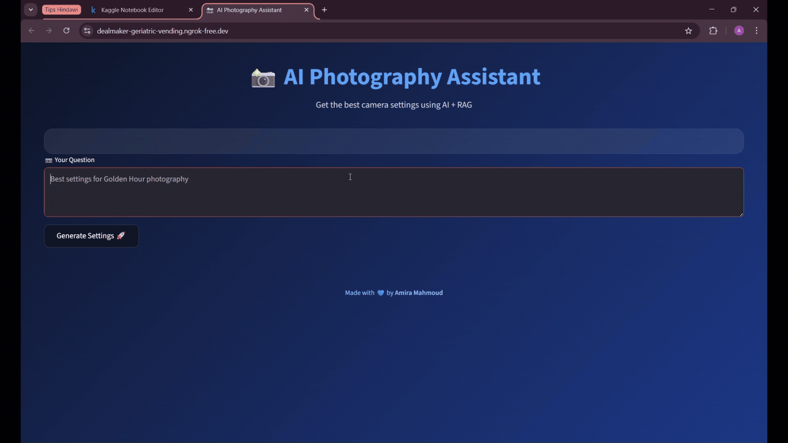

# 📸 AI-Photography-Assistant

Photography assistant using a Retrieval-Augmented Generation (RAG) approach to generate smart camera settings (ISO, aperture, shutter speed) based on user-defined styles and conditions.

---

## 🎥 Demo

---
